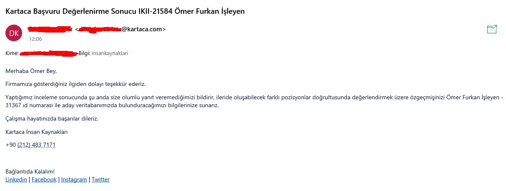
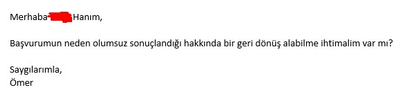
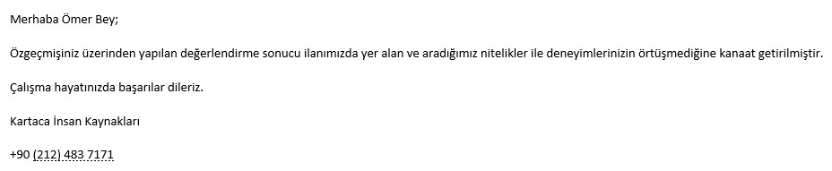
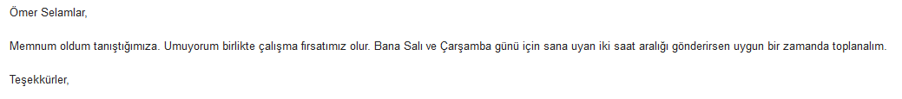
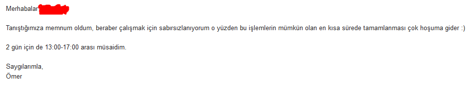
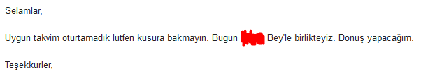
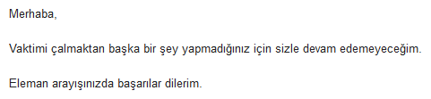

# Mülakat Günlüğüm

Bu yazı, benim mülakat anılarımı ve şirketler hakkında yorumlarımı içermektedir.

- [BGA / SOCRadar](#bga--socradar)
- [Istec](#istec)
- [Kodluyoruz](#kodluyoruz)
- [Patika](#patika)
- [Alictus](#alictus)
- [Radity](#radity)
- [Udemy](#udemy)
- [Prodaft](#prodaft)
- [Kartaca](#kartaca)
- [Ecommercio](#ecommercio)

## BGA / SOCRadar

### Başvurulan Pozisyon: **Stajyer**

Aslen BGA Security için yapmış olduğum staj başvurusu, anlaşmalı oldukları **SOCRadar** şirketi tarafından üstlenildi. İlk olarak 2 saatlik bir online sınav gerçekleşti. Bu sınavdan geçen 20 kişiyi (ben de geçtim) mülakata soktular. Bu 20 kişilik mülakattan sadece 10 kişi staja kabul edilecekti. Ben maalesef elendim.

Elenmemin ardından feedback (geri dönüş) maili attım. Güzelce dönüş yapıldı:

#### + Yönler

- Samimi insanlar. Hem maillerinde hem mülakatta çok ciddi olmayan, samimi bir tavır sergilediler.
- Gençlere imkan vermesi. (Üniversite'de 1.sınıfa geçicekken başvurdum.)
- Feedback mailine dönüş yapılması.

#### - Yönler

Yok

## Istec

### Başvurulan Pozisyon: **Stajyer**

Mülakat için mail attılar. Kendi belirledikleri vakite uygun olup olmadığımı eğer uygun değilsem uygun bir vaktimi onlara belirtmemi istediler. Ayarladıkları vakit benim için uygun değildi ben de uygun bir vaktimi belirttiğimde o tarih için bir Google Meet ayarlandı. 18.10.2021 Pazartesi günü saat 13:00 da gerçekleşicekti. Mülakata 2-3 dakika erkenden giriş yapıp beklemeye başladım. **40 dakika onları bekledim ama gelmediler.** Üstüne üstlük bu mülakata katılmamalarının sebebini açıklayan herhangi bir mail, geri dönüş yapılmadı bana.

#### + Yönler

- Gençlere imkan vermesi
- Mülakat için uygun vaktin bize danışılarak belirlenmesi

#### - Yönler

- Mülakata katılmayıp ayrıca bir geri dönüş yapılmaması

## Kodluyoruz

### Başvurulan Pozisyon: **Junior Document Translator (Gönüllü)**

Unity'nin kendi sitesindeki eğitimleri türkçeye çevirmeye yönelik bir proje için çevirmen arıyorlardı. Ben ve ablam Büşra ile başvurduk. Bize ilk olarak örnek bir çeviri projesi verildi. Ablamla birlikte anlaşarak, yarısını ben yarısını ablam yapacak şekilde çevirdik. Çeviriyi onlara gönderirken ablam bir dosyayı yanlış gönderdiği için ona olumsuz dönüldü bana ise olumlu dönüldü ve beni çeviri ekiplerine eklediler. Bunun üzerine ben onlara mail atıp, çeviriyi ablamla birlikte yaptığımızı, onun yanlış dosyayı gönderdiğini ve mümkünse onu da çeviri ekibine ekleyebilme ihtimalimizin olup olmadığını sordum. Ve kabul ettiler.

Üzerimize atanan çeviri işini başarılı şekilde yaptık. Bu işin gönüllü olduğunu bildiğimiz için bir karşılık beklemiyorduk tabi ki de.

Bir gün böyle bir mesaj aldık:

Adresimizi, telefon numaramızı verdik. Ama o hediye hiçbir zaman gelmedi...

Bu çeviri işinden sonra, yeni bir çevirişi işi çıktı. Bu sefer FreeCodeCamp'in Makine Öğrenmesi ile alakalı videolarını çevirecektik. Bu çeviri için görevlerin verildiği yani herkesin bulunduğu bir meet (görüşmede) bize bu işin sonunda adımızı sosyal medyada paylaşacaklarını, ve bir belge vereceklerini söylediler.

Bu çeviri işi de bitti ama o vaad ettikleri hiçbir zaman gelmedi...

#### + Yönler

- Samimi insanlar.

#### - Yönler

- Sözlerini yerine getirmediler.

## Patika

### Başvurulan Pozisyon: **Bootcamplere Katılım**

Patika'nın anlaşmalı olduğu çeşitli şirketlerle bootcampleri oluyor. Bu bootcampler in önemli noktası bootcampi düzenleyen şirkette işe girebilme ihtimalinin olması. Ben de özellikle Python, Django ile alakalı olan bootcamplere başvurdum ancak hepsinden yaşımdan, üniversiteden dolayı red yedim.

Sürekli reddetmelerinden kaynaklı bir mülakat deneyimim olmadı.

#### + Yönler

- Yok.

#### - Yönler

- Üniversite 3, 4 veya mezun dışındaki insanların reddedilmesi.

## Alictus

### Başvurulan Pozisyon: **Software Developer (Tools and Solutions) - REMOTE**

İşin amacının Python ile kendi işlerini kolaylaştıracak araçların yapılması olarak anladığım bu ilana başvurdum. Bana bir CaseStudy (Örnek proje) gönderdiler. Bu projenin içerisinde kesinlikle yapılması gerekenler ve ayrıca yapılırsa BONUS olan görevler vardı. Ben bu projeyi bonuslarıyla beraber bitirdim.

Projeyi onlara gönderdikten mailimi aldıklarını belirten ve **en kısa sürede** bana dönüş yapmalarını söyleyen bir mail attılar. Bekledim, bekledim, bekledim ama bir dönüş olmadı. **25 gün sonra** ben mail attım ve durumu onlara sordum. Onlar ise bana bunu dedi:

> Sistemsel bir karışıklık yaşandığı için sürecimizde gecikme yaşamışız, şu an kontrol ettiğimde fark ettim, kusura bakma lütfen.

Bunun üzerine olumlu olduğunu belirtip, benden mülakat için uygun olduğum zamanı istediler. Zamanı belirledikten sonra mülakata girdim. Bir süre sonra insan kaynaklarından bir kadın beni telefonla aradı ve sürecin olumlu geçtiğini şimdi ise CEO'larla ayrı bir mülakata girmem gerektiğini söyledi.

CEO'larla ayrıca bir mülakata girdim. Bir süre sonra yine aynı insan kaynaklarındaki kadın beni aradı ve bu sefer sürecin olumsuz geçtiğini söyledi.

Feedback istediğimde ise, teknik bilgimin yetersiz olduğu söylendi (verdikleri CaseStudy'i BONUS'larıyla birlikte yapmama rağmen).

#### + Yönler

- İyi insan kaynakları, reddederken bile telefonla arayıp güzelce reddedildiğini belirten samimi insanlar.

#### - Yönler

- Ben dürtmediğim sürece, bana dönmeyi unutmaları.
- Eksik veya yanlış feedback, zira verdikleri projeyi başarılı bir şekilde yapmıştım, onlar bunu kabul etmesine rağmen teknik bilgimin eksik olduğunu öne sürdüler.

## Radity

### Başvurulan Pozisyon: **Python Software Engineer**

Pozisyona LinkedIn üzerinden başvurdum. Güzel bir şekilde, mülakat için uygun bir saat seçmemi istedikleri bir mail attılar.

Yanlış hatırlamıyorsam 3-4 kişi ile bir mülakat gerçekleştirdim. Python hakkında basit sayılabilecek teknik sorularla da karşılaştım. Örnek olarak \*args ve \*\*kwargs ı açıklamamı istemişlerdi.

Mülakatta öncelikle bir kadınla konuşmaya başladım. O anda diğer bir erkek benim GitHub profilimi inceliyor olacak ki, onunla konuşmaya başladığımda konuya GitHub üzerinden başladı.

GitHub profilimi beğendiğini belirtti. Websocket, Design patters ile alakalı projelerimi gördüğünde ise, şuna benzer karşılık verdi:

> Üniversitenin 1.sınıfında websocket, design patterns öğretmiyorlar ki! hayret, nasıl öğrendin bunları?

Ben de üniversitenin zorunlu olmadığını hatta benden daha küçük olup daha da bilgili birilerinin olduğunu belirtince, gelen cevap:

> Doğrudur, vardır böyle birileri

Sonuç olarak bu mülakat olumlu sonuçlandı.

CTO'larıyla ayrı bir mülakata girdim. Bu mülakatta da 3 civarı kişi vardı. Mülakattakilerden birisi, Medium'daki pip ile alakalı [makalemi](https://omerfi.medium.com/i%CC%87stenilen-k%C3%BCt%C3%BCphaneyi-i%CC%87ndirmemize-ra%C4%9Fmen-i%CC%87nmemi%C5%9F-gibi-g%C3%B6stermesinin-sebebi-python-e5b18078c542) okumuş ve beğenmiş. Bu makalem hakkında soru sordu. Görüşünü belirtti.

Bu mülakattan güzel bir şekilde ayrılmıştım, CTO'yu, mülakattaki diğer kişileri sevmiştim. Hatta CTO'nun şöyle garip bir sorusuyla da karşılaştım:

> 3 tane atılan yazı-tura dan 2 yazı 1 tura gelme ihtimali nedir?

Ben cevabı düşünürken, çok önemsemeyip sorun olmadığını bunu genelde çalışanlarına sorduklarını söylediler. Böyle bir samimi, hoş mülakat geçirmiştim.

Ta ki, bu maili alana kadar...

#### + Yönler

- Samimi insanlar.

#### - Yönler

- Feedback mailime dönüş yapılmadı.
- Tüm konuşmaların, maillerin Türkçe yapılmasına rağmen, red mailinin İngilizce yapılması.

## Udemy

### Başvurulan Pozisyon: **Software Engineer Intern**

Hiç beklemediğim halde, Udemy'nin bu staj pozisyonu için ingilizce bir mail aldım. HackerRank üzerinde bir sınav hazırlamışlardı. Sınavı çözmemizi istediler.

Sınava girdim ama yarısını bile bitiremedim. Dolayısıyla bir mülakat deneyimim olmadı.

#### + Yönler

- Büyük bir şirket olmasına rağmen, güzelce insanlara dönüş yapıp, hazırladıkları sınava girmemizi istemeleri.
- Sınavı bitirememe rağmen, sonradan kendilerinin, onları değerlendirmek için bir form atmaları.

#### - Yönler

- Staja girmek için bile çok fazla bilgi gerekmesi.

## Prodaft

### Başvurulan Pozisyon: **Software Development Intern**

[Mehmet Dursun İnce](https://www.twitch.tv/mdisec)'nin Twitch üzerindeki yayınında, böyle bir ilan açacağını duyurması sonucu, ilanın açılmasını sabırsızlıkla bekledim.

Kendileri daha önceden beni [ofislerine çağırmışlardı](https://youtu.be/vOTJbyEnjz8) ve Yazılım Geliştirme takım lideri Osman abiyle tanışma fırsatı tanımışlardı. Harika geçen bir tanışma ve ofislerini gezmemden sonra ve böyle bir staj programının duyurulmasından sonra bu programa başvurmayacak değildim tabi ki.

Vee ilan duyuruldu. Başvurdum.

Bir süre sonra mutlu haber geldi:

Çok mutlu olmuştum. Diğer şirketlerden aldığım onca redden sonra, o redlerin böyle güzel bir durumun habercisi olduğunu düşünüyordum.

Ve Beklenen gün geldi. 2 saatlik mesafeli bir yolculukla beraber 2 saat erkenden varmıştım ofisin bulunduğu Teknopark İstanbul'a. 2 saat boyunca bölgede dolaştıktan sonra benim için ayarlanan vakitte ofise girdim.

Mehmet Dursun İnce ile karşılamıştım. Ayrıca ayrılırken kendisine sarılma imkanım da oldu :')

Beni bir odaya gönderdiler, orada 2 kişi vardı onlarla birlikte olucaktı bu mülakat süreci. Teknik bir soru sormadılar. Kendim hakkında genel olarak diğer mülakatlardaki gibi sorular geldi. 10 dakika sürmüştü mülakat ve ofisten ayrıldım.

4 saatlik bir sürecin (2 saat yol + 2 saat erken geliş) sadece 10 dakikalık bir mülakatla sonuçlanması ve mülakatta heyecanlanıp konuşamamamın üzüntüsüyle ayrılmıştım.

Bir süre sonra gelen mail:

Bunun üzerine maili gönderen Mert Kadir Gürsoy'a bir feedback maili attım ama bir geri dönüş olmadı.

Aynı şekilde Mehmet Dursun İnce'ye de bir feedback maili attım. Ama durum aynı :(

#### + Yönler

- Özellikle Mehmet Dursun İnce'nin, yayınlarıyla birlikte gençlere değer vermesi. Ve beni önceden ofislerine çağırıp, Osman abiyle tanıştırması.

#### - Yönler

- Feedback mailine geri dönüş yapılmaması.

## Kartaca

### Başvurulan Pozisyon: **Django Developer**

LinkedIn üzerinden başvurmuştum. Aradan 1 ay geçtikten sonra döndüler:

Bu dönüşlerinin üzerine, yukarıda anlattığım çoğu firmadan feedback istemem gibi bu firmadan da bir feedback istedim.

Diğer firmalardan alışık olduğum üzere, asla dönüş yapılacağını ummuyordum. Ama şaşırtıcı bir şekilde dönüş aldım:

Diğer firmaların atamadığı bir feedback mailini atan Kartaca'ya eğer bu yazıyı okuyorlarsa teşekkürlerimi iletiyorum.

#### + Yönler

- Feedback mailime dönüş yapılması

#### - Yönler

- Geç dönüş yapılması

## Ecommercio

### Başvurulan Pozisyon: **Python Backend Developer**

Bu [ilanı](https://twitter.com/erenturkay/status/1696394722586075164) Zafer Ayan'ın Twitter'daki gönderisinin altında gördüm. İlan açıklamasında, Python 3.10+, Celery, mypy gibi kütüphaneleri kullandıklarını görünce ilanın tamamen bana göre olduğunu düşündüm ve başvurdum.

Son sürüm Python kullanmalarına dikkat eden, güncel kütüphaneler, best practicelere dikkat eden bir yazılım ekibi olduğunu düşündüğüm için çok heyecanlanmıştım.

Başvuru yaptığım gün içerisinde dönüş yaptılar ve meet ayarladık. İlk meet 31 Ağustos'da gerçekleşecekti.

Bu meet'te ilanı paylaşan ve anladığım kadarıyla yazılım kısmından sorumlu olan Eren beyle tanıştıktan sonra 6 Eylül tarihinde bir teknik görüşme ayarlandı.

Aynen bahsettikleri gibi oldu, teknik görüşmede hackerrank soruları gibi algoritma sorularıyla karşılaşmadım ve sohbet havasında çok güzel geçmişti. Görüşmenin sonunda ise `başka yerlerle görüşmememi` ve bundan sonra insan kaynaklarıyla olan meetlerden sonra aramızda görmek istediğini söyledi.

Buraya kadar her şey muhteşem. Ama sonrası...

11 Eylül Pazartesi günü gelen yukarıdaki mailden ne anlardınız? Gün içerisinde saat belirticeğinizi ve salı veya çarşamba gününe meet atanacağını değil mi?

Yukarıdaki mail geldikten 2 saat sonra (mesai saati içerisinde) dönüş yaptım.

> Salak kafam gidip en kısa sürede tamamlanması çok hoşuma gider yazmışım 🤣🤣

Ve 1 hafta boyunca dönüş olmadı.

18 Eylül Pazartesi günü dönüş yaptım.

**Dönüş yapacağını** iddia eden maille aynı gün içerisinde cevap veriyor.

Ve artık haftanın son günü 22 Eylül Cuma günü dayanamayıp son noktayı koydum.

Ve böylece 29 Ağustos'da başlayan hayallerim 22 Eylülde sulara düştü.

#### + Yönler

- Teknik kısımda son teknolojileri kullanmaları
- Teknik mülakatta saf hackerrank vari algoritma soruları sormamaları

#### - Yönler

- İK
- İK
- İK
